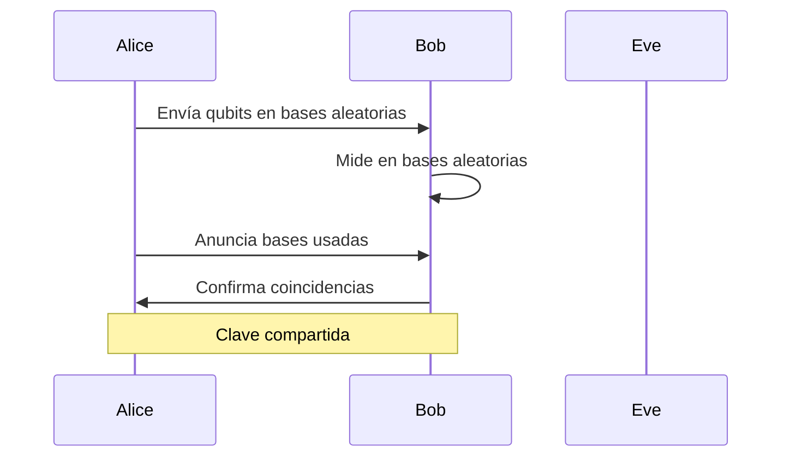

# 🎯 Propuesta Definitiva: Sistema RAG Agéntico para Biblioteca Técnica

**Versión:** 1.0  
**Fecha:** 2 de enero de 2026  
**Autor:** Asistente AI  
**Objetivo:** Generar apuntes técnicos avanzados con máxima fidelidad a fuentes originales

---

## 1. Visión General del Sistema

### 1.1 Objetivo Principal

Construir un sistema de Retrieval-Augmented Generation (RAG) agéntico que permita:

- Generar apuntes técnicos en Markdown/LaTeX basados en tu biblioteca personal
- Recuperar información relevante por muy "escondida" que esté en los documentos
- Citar fuentes con precisión quirúrgica (documento + sección exacta)
- Minimizar alucinaciones mediante grounding estricto

### 1.2 Características Clave

| Característica   | Descripción                                                 |
| ---------------- | ----------------------------------------------------------- |
| **Integración**  | CLI directa en terminal/VS Code (sin MCP)                   |
| **Búsqueda**     | Híbrida: semántica (vectores) + léxica (BM25) + grafo       |
| **Re-ranking**   | Cross-Encoder opcional para +15-25% precisión               |
| **HyDE**         | Query expansion con documentos hipotéticos (+10-20% recall) |
| **Evaluación**   | Pipeline RAGAS: faithfulness, relevancy, precision          |
| **Cache**        | Embeddings cacheados: -70-90% costes, 0ms latencia          |
| **Filtrado**     | Por categoría/metadata para reducir ruido de dominios       |
| **Chunking**     | Jerárquico con auto-merge para contexto coherente           |
| **Citas**        | Rutas de encabezado (ej: `Libro > Cap 3 > Sec 3.2`)         |
| **Verificación** | Evaluación automática de fidelidad pre-entrega              |
| **Privacidad**   | Datos 100% locales, solo APIs para LLM de generación        |

### 1.3 Stack Tecnológico Recomendado

| Componente    | Tecnología                        | Justificación                                                 |
| ------------- | --------------------------------- | ------------------------------------------------------------- |
| Framework RAG | **LlamaIndex**                    | Soporte nativo para chunking jerárquico, citations, workflows |
| Vector DB     | **Qdrant** (Docker)               | Escalable, filtrado por metadatos, HNSW eficiente             |
| Índice léxico | **BM25 via rank_bm25**            | Ligero, sin servidor, complementa búsqueda semántica          |
| Re-ranker     | **Cross-Encoder (ms-marco)**      | Mejora precisión post-fusión, modelos locales eficientes      |
| Evaluación    | **RAGAS (LLM-as-judge)**          | Métricas estándar: faithfulness, relevancy, precision         |
| Cache         | **SQLite + LRU in-memory**        | Reduce costes 70-90%, elimina latencia en queries repetidas   |
| Embeddings    | **OpenAI text-embedding-3-large** | Mejor relación calidad/precio ($0.13/1M tokens)               |
| LLM Síntesis  | **Claude 3.5 Sonnet**             | 200k contexto, analítico, excelente en técnico                |
| LLM Ruteo     | **GPT-4o-mini**                   | Ultra-económico para clasificación y planificación            |
| Grafo         | **NetworkX** (en memoria)         | Suficiente para ~500 páginas, sin infraestructura extra       |

---

## 2. Arquitectura del Sistema

### 2.1 Diagrama de Componentes

```
┌─────────────────────────────────────────────────────────────────┐
│                         USUARIO                                  │
│                    (Terminal / VS Code)                          │
└─────────────────────────┬───────────────────────────────────────┘
                          │ CLI: ask_library "pregunta"
                          ▼
┌─────────────────────────────────────────────────────────────────┐
│                    CAPA DE INTERFAZ                              │
│  ┌─────────────┐  ┌─────────────┐  ┌─────────────┐              │
│  │ CLI Parser  │  │ Query       │  │ Output      │              │
│  │ (argparse)  │  │ Formatter   │  │ Renderer    │              │
│  └─────────────┘  └─────────────┘  └─────────────┘              │
└─────────────────────────┬───────────────────────────────────────┘
                          ▼
┌─────────────────────────────────────────────────────────────────┐
│                    CAPA AGÉNTICA                                 │
│  ┌─────────────┐  ┌─────────────┐  ┌─────────────┐              │
│  │ Router      │  │ Planner     │  │ Critic      │              │
│  │ (GPT-4o-m)  │  │ (Decompose) │  │ (Verify)    │              │
│  └─────────────┘  └─────────────┘  └─────────────┘              │
└─────────────────────────┬───────────────────────────────────────┘
                          ▼
┌─────────────────────────────────────────────────────────────────┐
│                    CAPA DE RECUPERACIÓN                          │
│  ┌─────────────┐  ┌─────────────┐  ┌─────────────┐              │
│  │ Vector      │  │ BM25        │  │ Graph       │              │
│  │ Retriever   │  │ Retriever   │  │ Traversal   │              │
│  └──────┬──────┘  └──────┬──────┘  └──────┬──────┘              │
│         └────────────────┼────────────────┘                      │
│                          ▼                                       │
│  ┌─────────────┐  ┌─────────────┐      ┌─────────────┐          │
│  │ HyDE        │  │ Fusion +    │ ───▶ │ Re-Ranker   │          │
│  │ (opcional)  │  │ Auto-Merge  │      │ (opcional)  │          │
│  └─────────────┘  └─────────────┘      └─────────────┘          │
└─────────────────────────┬───────────────────────────────────────┘
                          ▼
┌─────────────────────────────────────────────────────────────────┐
│                    CAPA DE GENERACIÓN                            │
│  ┌─────────────┐  ┌─────────────┐  ┌─────────────┐              │
│  │ Context     │  │ LLM         │  │ Citation    │              │
│  │ Builder     │  │ (Claude)    │  │ Injector    │              │
│  └─────────────┘  └─────────────┘  └─────────────┘              │
└─────────────────────────┬───────────────────────────────────────┘
                          ▼
┌─────────────────────────────────────────────────────────────────┐
│                    CAPA DE ALMACENAMIENTO                        │
│  ┌─────────────┐  ┌─────────────┐  ┌─────────────┐              │
│  │ Qdrant      │  │ BM25 Index  │  │ Knowledge   │              │
│  │ (Vectores)  │  │ (Pickle)    │  │ Graph       │              │
│  └─────────────┘  └─────────────┘  └─────────────┘              │
└─────────────────────────────────────────────────────────────────┘
```

### 2.2 Flujo de Datos

1. **Ingesta** (offline, una vez):

   - Markdown → Parser → Chunks jerárquicos → Embeddings → Índices

2. **Consulta** (runtime):
   - Pregunta → Router → Recuperación híbrida → Fusión → Síntesis → Respuesta citada

---

## 3. Ingeniería de Datos

### 3.1 Preparación de Documentos

Tu biblioteca ya está en Markdown (vía Mathpix), lo cual es ideal. Asegurar:

| Aspecto     | Requisito                           | Verificación                          |
| ----------- | ----------------------------------- | ------------------------------------- |
| Encabezados | Jerarquía clara (`#`, `##`, `###`)  | Revisar que cada sección tenga título |
| Fórmulas    | Delimitadas por `$$...$$` o `$...$` | No partir fórmulas entre chunks       |
| Código      | En bloques ```                      | Tratar como unidad atómica            |
| Metadatos   | Nombre archivo = título libro/paper | Consistencia en nomenclatura          |

### 3.2 Estrategia de Chunking Jerárquico

El sistema debe crear **3 niveles de fragmentos** vinculados entre sí:

| Nivel                 | Tamaño           | Contenido                        | Uso                             |
| --------------------- | ---------------- | -------------------------------- | ------------------------------- |
| **Macro** (Padre)     | 2048-4096 tokens | Sección/subcapítulo completo     | Contexto amplio para respuestas |
| **Meso** (Intermedio) | 512 tokens       | Párrafos relacionados            | Balance precisión/contexto      |
| **Micro** (Hoja)      | 128-256 tokens   | Definiciones, teoremas, fórmulas | Búsqueda de alta precisión      |

**Mecanismo Auto-Merge:**

- Se indexan los chunks **Micro** (máxima densidad semántica)
- Si la búsqueda recupera >50% de los hijos de un mismo padre → devolver el padre completo
- Esto garantiza contexto coherente sin fragmentos inconexos

### 3.3 Metadatos por Chunk

Cada fragmento debe almacenar:

```
{
  "doc_id": "nielsen_chuang_qc",
  "doc_title": "Quantum Computation and Quantum Information",
  "header_path": "Cap 4 > Sec 4.2 > Teorema de No-Clonación",
  "parent_id": "chunk_macro_042",
  "level": "micro",
  "start_char": 45230,
  "end_char": 45890
}
```

La `header_path` es la **cita semántica** que reemplaza números de página.

---

## 4. Sistema de Recuperación Avanzado

### 4.1 Búsqueda Híbrida (Vector + BM25)

| Método        | Fortaleza                                               | Debilidad                 |
| ------------- | ------------------------------------------------------- | ------------------------- |
| **Vectorial** | Similitud conceptual ("red neuronal" ≈ "deep learning") | Falla en términos exactos |
| **BM25**      | Coincidencia exacta ("Error 0x8004", "v2.1.4")          | No entiende sinónimos     |

**Fusión con Reciprocal Rank Fusion (RRF):**

- Recuperar top-50 de cada índice
- Calcular score RRF: `1 / (k + rank)` con k=60
- Combinar y reordenar
- Pasar top-20 a reranker (opcional: Cohere Rerank)
- Seleccionar top-5 finales

### 4.2 Grafo de Conocimiento

Para tu biblioteca de física/computación cuántica, definir ontología:

**Entidades:**

- `Algoritmo` (Shor, Grover, VQE...)
- `Protocolo` (BB84, E91, QKD...)
- `Concepto` (Entrelazamiento, Decoherencia...)
- `Autor` (Nielsen, Chuang, Preskill...)
- `Paper/Libro`

**Relaciones:**

- `MEJORA` (Algoritmo A mejora B)
- `DEPENDE_DE` (Protocolo usa Concepto)
- `CITA` (Paper X cita Paper Y)
- `DEFINE` (Libro define Concepto)

**Uso:** Cuando la búsqueda vectorial encuentra un concepto, el grafo permite "saltar" a documentos relacionados aunque no compartan palabras clave.

### 4.3 Flujo de Recuperación Agéntica (Deep Research)

```
1. CLASIFICAR consulta y ASIGNAR PESOS DINÁMICOS:
   - Simple (definición directa) → Búsqueda única
   - Compleja (comparación, multi-concepto) → Descomponer
   - Pesos según tipo detectado:
     * Términos exactos (BB84, Shor): bm25=0.6, vector=0.3, graph=0.1
     * Conceptual: vector=0.5, bm25=0.3, graph=0.2
     * Relacional: graph=0.5, vector=0.3, bm25=0.2
     * Comparativa: vector=0.4, bm25=0.3, graph=0.3

2. Si compleja, DESCOMPONER en sub-preguntas:
   - "Compara BB84 con E91" → ["¿Qué es BB84?", "¿Qué es E91?", "Diferencias"]

3. Para cada sub-pregunta, BUSCAR:
   a) (Opcional) HyDE: Generar documentos hipotéticos → embedding multi-query
   b) Vector search (top-30)
   c) BM25 search (top-30)
   d) Graph traversal (si detecta entidad conocida)
   e) Fusión RRF → top-10
   f) (Opcional) Re-ranking con Cross-Encoder → top-k refinado

4. EVALUAR suficiencia (Critic):
   - ¿Los fragmentos cubren la pregunta?
   - ¿Hay contradicciones?
   - ¿Falta algún aspecto?

5. Si insuficiente, ITERAR:
   - Reformular query
   - Buscar en documentos conectados vía grafo
   - Máximo 3 iteraciones

6. APLICAR Auto-Merge:
   - Consolidar chunks hermanos en padres

7. ENTREGAR contexto final al generador
```

---

## 5. Generación con Citas

### 5.1 Estructura del Prompt

```
[SISTEMA]
Eres un asistente académico que genera apuntes técnicos basándote
EXCLUSIVAMENTE en los documentos proporcionados.

Reglas:
1. Cada afirmación debe tener una cita [n] al fragmento que la respalda
2. Si la información no está en los documentos, responde "No encontrado"
3. Usa formato Markdown con fórmulas LaTeX cuando sea apropiado
4. Preserva la precisión técnica de las fuentes

[DOCUMENTOS]
[1] {texto fragmento 1}
    Fuente: {doc_title} > {header_path}

[2] {texto fragmento 2}
    Fuente: {doc_title} > {header_path}

...

[PREGUNTA]
{pregunta del usuario}

[FORMATO DE RESPUESTA]
- Respuesta estructurada en Markdown
- Citas inline [n] para cada dato
- Sección "Referencias" al final listando las fuentes usadas
```

### 5.2 Verificación Pre-Entrega (Critic)

Antes de mostrar la respuesta, un segundo LLM (o el mismo con diferente prompt) evalúa:

| Criterio        | Pregunta de Evaluación                                | Acción si Falla                 |
| --------------- | ----------------------------------------------------- | ------------------------------- |
| **Fidelidad**   | ¿Cada afirmación tiene cita y está en los fragmentos? | Eliminar afirmación sin soporte |
| **Completitud** | ¿Se respondió toda la pregunta?                       | Buscar más información          |
| **Coherencia**  | ¿Hay contradicciones entre fuentes?                   | Señalar discrepancia            |

Si fidelidad < 90%, regenerar respuesta o marcar secciones dudosas.

### 5.3 Política de Abstención

El sistema **debe abstenerse** de responder cuando:

- Score máximo de fragmentos recuperados < 0.65 (similitud baja)
- Critic detecta >2 afirmaciones sin soporte
- La pregunta está claramente fuera del dominio de la biblioteca

Respuesta en estos casos:

> "No he encontrado información suficiente en la biblioteca para responder con certeza. Los documentos más cercanos son: [listar]. ¿Deseas que busque de otra manera?"

---

## 6. Ejecución de Código y Diagramas

Para respuestas que requieran cálculos, simulaciones o visualizaciones, el sistema incluye capacidad de ejecutar código de forma controlada.

### 6.1 Casos de Uso

| Tipo             | Ejemplo de Pregunta                         | Acción del Sistema                              |
| ---------------- | ------------------------------------------- | ----------------------------------------------- |
| **Gráficas**     | "Grafica la distribución de Boltzmann"      | Genera código matplotlib, ejecuta, inserta PNG  |
| **Cálculos**     | "Calcula la entropía de von Neumann para ρ" | Genera código NumPy, ejecuta, muestra resultado |
| **Diagramas**    | "Diagrama del protocolo BB84"               | Genera bloque Mermaid inline                    |
| **Simulaciones** | "Simula 1000 mediciones de un qubit"        | Genera código, ejecuta, muestra estadísticas    |

### 6.2 Arquitectura de Sandbox

```
┌─────────────────────────────────────────────────────────────┐
│                    AGENTE RAG                                │
│  ┌─────────────┐                                            │
│  │ Detectar    │  "Grafica..." / "Calcula..." / "Simula..." │
│  │ necesidad   │────────────────────────────────────────────│
│  └──────┬──────┘                                            │
│         │                                                    │
│         ▼                                                    │
│  ┌─────────────┐     ┌─────────────────────────────────┐    │
│  │ Generar     │────▶│         SANDBOX                 │    │
│  │ código      │     │  ┌─────────────────────────┐    │    │
│  └─────────────┘     │  │ Docker container        │    │    │
│                      │  │ - Sin acceso a red      │    │    │
│                      │  │ - Timeout: 30s          │    │    │
│                      │  │ - RAM límite: 512MB     │    │    │
│                      │  │ - Solo libs permitidas  │    │    │
│                      │  └─────────────────────────┘    │    │
│                      │              │                   │    │
│                      │              ▼                   │    │
│                      │  stdout/stderr + archivos PNG   │    │
│                      └─────────────────────────────────┘    │
│         │                                                    │
│         ▼                                                    │
│  ┌─────────────┐                                            │
│  │ Insertar    │             │
│  │ en respuesta│                                            │
│  └─────────────┘                                            │
└─────────────────────────────────────────────────────────────┘
```

### 6.3 Librerías Permitidas en Sandbox

```python
ALLOWED_IMPORTS = [
    "numpy",
    "scipy",
    "matplotlib",
    "sympy",        # Para álgebra simbólica
    "qutip",        # Para simulaciones cuánticas
    "pandas",
    "math",
    "cmath",
]

BLOCKED = [
    "os", "sys", "subprocess", "socket",
    "requests", "urllib", "__import__"
]
```

### 6.4 Diagramas Mermaid

Para diagramas, el LLM genera directamente bloques Mermaid que VS Code renderiza:

````markdown

````

````

### 6.5 Consideraciones de Seguridad

| Riesgo | Mitigación |
|--------|------------|
| Código malicioso del LLM | Sandbox aislado, whitelist de imports |
| Bucles infinitos | Timeout estricto (30s) |
| Consumo excesivo de recursos | Límites de CPU/RAM en Docker |
| Exfiltración de datos | Sin acceso a red ni filesystem host |

---

## 7. Observabilidad y Logging

### 7.1 Capas de Logging

| Capa | Qué se registra | Herramienta |
|------|-----------------|-------------|
| **Consultas** | Query original, timestamp, user_id | JSON logs |
| **Recuperación** | Chunks recuperados, scores, tiempo | JSON logs |
| **Generación** | Tokens in/out, modelo usado, coste | JSON logs |
| **Errores** | Stack traces, queries fallidas | Python logging |

### 7.2 Estructura de Log por Consulta

```json
{
  "session_id": "2026-01-02_143522_abc123",
  "timestamp": "2026-01-02T14:35:22Z",
  "query": "¿Qué es el teorema de no-clonación?",
  "query_type": "simple",
  "retrieval": {
    "vector_results": 30,
    "bm25_results": 28,
    "after_fusion": 10,
    "final_chunks": 5,
    "top_score": 0.89,
    "sources": ["nielsen_chuang", "preskill_notes"],
    "time_ms": 450
  },
  "generation": {
    "model": "claude-3-5-sonnet",
    "tokens_in": 3200,
    "tokens_out": 480,
    "time_ms": 2100,
    "cost_usd": 0.018
  },
  "verification": {
    "fidelity_score": 0.95,
    "citations_valid": 3,
    "citations_total": 3
  },
  "total_time_ms": 2800
}
````

### 7.3 Dashboard de Métricas (Opcional)

Para análisis agregado, se puede usar **Grafana + JSON logs** o una solución ligera:

```
📊 MÉTRICAS ÚLTIMOS 7 DÍAS
─────────────────────────────────────────
Consultas totales:          247
Coste acumulado:            $9.38
Tiempo medio respuesta:     3.2s
Fidelidad media:            94.2%
Abstenciones:               12 (4.9%)

Top 5 documentos citados:
  1. Nielsen & Chuang (89 citas)
  2. Preskill Notes (45 citas)
  3. BB84 Paper (23 citas)
  ...
```

### 7.4 Herramientas de Observabilidad Avanzada

Para debugging detallado de flujos agénticos:

| Herramienta          | Propósito               | Integración             |
| -------------------- | ----------------------- | ----------------------- |
| **LangFuse**         | Tracing de LLM calls    | SDK Python, self-hosted |
| **Phoenix (Arize)**  | Visualización de traces | Open source             |
| **Weights & Biases** | Experimentos, evals     | Cloud (opcional)        |

---

## 8. Comparativa de Modelos LLM

### 8.1 Modelos para Generación (Síntesis)

| Modelo                | Contexto | Precio Input | Precio Output | Calidad Técnica | Recomendación  |
| --------------------- | -------- | ------------ | ------------- | --------------- | -------------- |
| **Claude 3.5 Sonnet** | 200K     | $3/1M        | $15/1M        | ⭐⭐⭐⭐⭐      | **Principal**  |
| GPT-4o                | 128K     | $2.50/1M     | $10/1M        | ⭐⭐⭐⭐⭐      | Alternativa    |
| GPT-4o-mini           | 128K     | $0.15/1M     | $0.60/1M      | ⭐⭐⭐          | Ruteo/Planning |
| Claude 3 Haiku        | 200K     | $0.25/1M     | $1.25/1M      | ⭐⭐⭐          | Verificación   |
| Gemini 1.5 Pro        | 1M       | $2.50/1M     | $10/1M        | ⭐⭐⭐⭐        | Contexto largo |
| **Llama 3.3 70B**     | 128K     | $0 (local)   | $0 (local)    | ⭐⭐⭐⭐        | 100% offline   |

### 8.2 Modelos para Embeddings

| Modelo                     | Dimensiones           | Precio   | Calidad    | Recomendación      |
| -------------------------- | --------------------- | -------- | ---------- | ------------------ |
| **text-embedding-3-large** | 3072 (256 comprimido) | $0.13/1M | ⭐⭐⭐⭐⭐ | **Principal**      |
| text-embedding-3-small     | 1536                  | $0.02/1M | ⭐⭐⭐⭐   | Económico          |
| BGE-M3 (local)             | 1024                  | $0       | ⭐⭐⭐⭐   | 100% offline       |
| Voyage-2                   | 1024                  | $0.10/1M | ⭐⭐⭐⭐⭐ | Técnico/científico |

### 8.3 Configuración Recomendada por Escenario

| Escenario          | LLM Principal     | LLM Ruteo      | Embeddings       | Coste/100 queries |
| ------------------ | ----------------- | -------------- | ---------------- | ----------------- |
| **Calidad máxima** | Claude 3.5 Sonnet | GPT-4o-mini    | text-emb-3-large | ~$4.00            |
| **Equilibrado**    | GPT-4o            | GPT-4o-mini    | text-emb-3-small | ~$2.50            |
| **Económico**      | Claude 3 Haiku    | Claude 3 Haiku | text-emb-3-small | ~$0.80            |
| **100% Local**     | Llama 3.3 70B     | Llama 3.3 8B   | BGE-M3           | ~$0 (hardware)    |

### 8.4 Opción 100% Local (Sin APIs)

Si la privacidad total es prioritaria o quieres eliminar costes variables:

**Requisitos hardware:**

- GPU: 2× RTX 4090 (48GB VRAM total) o 1× A100 80GB
- RAM: 64GB mínimo
- Almacenamiento: SSD NVMe 500GB+

**Stack:**

- LLM: Llama 3.3 70B vía **vLLM** (servidor de inferencia optimizado)
- Embeddings: **BGE-M3** vía sentence-transformers
- Vector DB: Qdrant (sin cambios)

**Trade-offs:**
| Aspecto | Con APIs | 100% Local |
|---------|----------|------------|
| Calidad | ⭐⭐⭐⭐⭐ | ⭐⭐⭐⭐ |
| Latencia | 2-5s | 5-15s |
| Coste variable | ~$0.04/query | $0 |
| Coste fijo | $0 | ~$200-500/mes (electricidad, amortización) |
| Privacidad | Datos salen a API | 100% local |

---

## 9. Integración CLI

### 9.1 Comandos Disponibles

| Comando                            | Descripción                     | Ejemplo                                             |
| ---------------------------------- | ------------------------------- | --------------------------------------------------- |
| `ask_library "pregunta"`           | Consulta principal              | `ask_library "¿Qué es el teorema de no-clonación?"` |
| `ask_library --verbose "pregunta"` | Muestra proceso de búsqueda     | Ver qué fragmentos se recuperaron                   |
| `ask_library --deep "pregunta"`    | Fuerza modo Deep Research       | Para preguntas complejas                            |
| `ask_library --sources "pregunta"` | Solo mostrar fuentes relevantes | Sin generar respuesta                               |
| `ingest_library`                   | Re-indexar biblioteca completa  | Tras añadir nuevos documentos                       |
| `ingest_library --update`          | Indexación incremental          | Solo documentos nuevos/modificados                  |

### 9.2 Formato de Salida

```markdown
╔══════════════════════════════════════════════════════════════════╗
║ RESPUESTA ║
╚══════════════════════════════════════════════════════════════════╝

El **teorema de no-clonación** establece que es imposible crear una
copia exacta de un estado cuántico arbitrario desconocido[1].

Matemáticamente, no existe un operador unitario $U$ tal que:
$$U|\psi\rangle|0\rangle = |\psi\rangle|\psi\rangle$$
para todo $|\psi\rangle$[1][2].

Este resultado tiene implicaciones fundamentales para la criptografía
cuántica, ya que garantiza que un espía no puede copiar qubits sin
ser detectado[3].

─────────────────────────────────────────────────────────────────────
📚 REFERENCIAS
─────────────────────────────────────────────────────────────────────
[1] Nielsen & Chuang - Quantum Computation > Cap 12 > Sec 12.1
[2] Preskill Notes > Cap 3 > Teorema 3.1  
[3] BB84 Paper > Sec 2 > Security Analysis

⏱️ Tiempo: 3.2s | 📊 Fragmentos consultados: 47 | 💰 Coste: $0.02
```

### 9.3 Integración con VS Code

**Opción A: Task en tasks.json**

- Crear task que ejecute `ask_library` con input del usuario
- Atajo de teclado personalizado (ej: `Ctrl+Shift+L`)

**Opción B: Alias en terminal**

- Añadir al `.bashrc`/`.zshrc`: `alias ask='python /ruta/ask_library.py'`
- Usar directamente: `ask "mi pregunta"`

**Opción C: Script wrapper**

- Script que abre resultado en nuevo archivo `.md` para preview

---

## 10. Indexación Incremental

### 10.1 Problema a Resolver

Al añadir nuevos documentos a la biblioteca, no queremos re-indexar todo desde cero. El sistema debe detectar qué cambió y procesar solo lo necesario.

### 10.2 Estrategia con Hashing

```
┌─────────────────────────────────────────────────────────────────┐
│                    PROCESO DE INGESTA                           │
└─────────────────────────────────────────────────────────────────┘
                              │
                              ▼
┌─────────────────────────────────────────────────────────────────┐
│  Para cada archivo .md en /data/markdown/                       │
│                                                                 │
│  1. Calcular hash SHA-256 del contenido                         │
│  2. Comparar con hash almacenado en manifest.json               │
│                                                                 │
│  ┌─────────────┬───────────────┬────────────────────────────┐   │
│  │ ¿Existe?    │ ¿Hash igual?  │ Acción                     │   │
│  ├─────────────┼───────────────┼────────────────────────────┤   │
│  │ No          │ -             │ INDEXAR (nuevo documento)  │   │
│  │ Sí          │ Sí            │ SKIP (sin cambios)         │   │
│  │ Sí          │ No            │ RE-INDEXAR (modificado)    │   │
│  └─────────────┴───────────────┴────────────────────────────┘   │
│                                                                 │
│  3. Actualizar manifest.json con nuevo hash                     │
└─────────────────────────────────────────────────────────────────┘
```

### 10.3 Estructura del Manifest

```json
{
  "last_updated": "2026-01-02T14:30:00Z",
  "documents": {
    "books/nielsen_chuang.md": {
      "hash": "a1b2c3d4e5f6...",
      "chunks": 245,
      "indexed_at": "2026-01-01T10:00:00Z"
    },
    "papers/bb84.md": {
      "hash": "f6e5d4c3b2a1...",
      "chunks": 32,
      "indexed_at": "2026-01-01T10:05:00Z"
    }
  }
}
```

### 10.4 Comandos de Ingesta

| Comando                    | Comportamiento                       |
| -------------------------- | ------------------------------------ |
| `ingest_library`           | Re-indexa TODO (ignora hashes)       |
| `ingest_library --update`  | Solo documentos nuevos/modificados   |
| `ingest_library --dry-run` | Muestra qué se indexaría sin hacerlo |

---

## 11. Estructura del Proyecto

```
quantum_library_rag/
│
├── config/
│   ├── settings.yaml          # Configuración general
│   └── ontology.yaml          # Definición de entidades/relaciones
│
├── data/
│   ├── markdown/              # Biblioteca de documentos .md
│   │   ├── books/
│   │   └── papers/
│   └── processed/             # Cache de chunks procesados
│
├── indices/
│   ├── qdrant/                # Base de datos vectorial
│   ├── bm25_index.pkl         # Índice BM25 serializado
│   └── knowledge_graph.gpickle # Grafo NetworkX
│
├── src/
│   ├── ingestion/
│   │   ├── parser.py          # Markdown parser con header_path
│   │   ├── chunker.py         # Chunking jerárquico
│   │   └── indexer.py         # Creación de índices
│   │
│   ├── retrieval/
│   │   ├── vector_retriever.py
│   │   ├── bm25_retriever.py
│   │   ├── graph_retriever.py
│   │   ├── fusion.py          # RRF + Auto-merge
│   │   ├── reranker.py        # Cross-Encoder re-ranking
│   │   ├── cache.py           # Cache de embeddings
│   │   └── hyde.py            # HyDE Query Expansion
│   │
│   ├── generation/
│   │   ├── prompt_builder.py
│   │   ├── synthesizer.py     # Llamada a LLM
│   │   └── citation_injector.py
│   │
│   ├── agents/
│   │   ├── router.py          # Clasificación + pesos dinámicos
│   │   ├── planner.py         # Descomposición
│   │   └── critic.py          # Verificación
│   │
│   └── cli/
│       ├── ask_library.py     # Punto de entrada CLI
│       └── ingest_library.py
│
├── logs/
│   └── sessions/              # Logs de cada consulta
│
├── outputs/
│   └── figures/               # Gráficas generadas (si aplica)
│
├── tests/
│   └── test_retrieval.py
│
├── requirements.txt
└── README.md
```

---

## 12. Estimación de Costes

### 12.1 Costes de Puesta en Marcha (CAPEX)

**Supuestos para tu biblioteca:**

- ~500 páginas totales (11 libros + 10 papers)
- ~375,000 tokens (750 tokens/página promedio)
- ~3,000 chunks (125 tokens/chunk promedio)

| Concepto                           | Cálculo                 |      Coste |
| ---------------------------------- | ----------------------- | ---------: |
| **Embeddings (indexación)**        | 375k tokens × $0.13/1M  |  **$0.05** |
| **Extracción grafo (GPT-4o-mini)** | ~500k tokens × $0.15/1M |  **$0.08** |
| **Qdrant (local Docker)**          | Self-hosted             |  **$0.00** |
| **BM25 (en memoria)**              | Sin coste               |  **$0.00** |
| **Desarrollo/Config**              | Tu tiempo               |   Variable |
|                                    |                         |            |
| **TOTAL SETUP**                    |                         | **~$0.15** |

> 💡 El coste de infraestructura es prácticamente nulo porque todo corre local excepto las APIs de embedding/LLM.

### 12.2 Costes por Uso (OPEX)

**Escenario: 100 consultas**

| Tipo de Consulta  | % del Total | Tokens In | Tokens Out | Modelo            | Coste/consulta |
| ----------------- | :---------: | --------: | ---------: | ----------------- | -------------: |
| **Simple**        |     60%     |     3,000 |        500 | Claude 3.5 Sonnet |         $0.016 |
| **Compleja**      |     30%     |    15,000 |      1,000 | Claude 3.5 Sonnet |         $0.060 |
| **Deep Research** |     10%     |    25,000 |      1,500 | Claude 3.5 Sonnet |         $0.098 |
| **Ruteo (todas)** |    100%     |       500 |         50 | GPT-4o-mini       |        $0.0001 |

**Cálculo para 100 consultas:**

| Componente                | Cálculo       |       Coste |
| ------------------------- | ------------- | ----------: |
| 60 consultas simples      | 60 × $0.016   |       $0.96 |
| 30 consultas complejas    | 30 × $0.060   |       $1.80 |
| 10 consultas deep         | 10 × $0.098   |       $0.98 |
| 100 ruteos                | 100 × $0.0001 |       $0.01 |
|                           |               |             |
| **TOTAL 100 consultas**   |               |   **$3.75** |
| **Promedio por consulta** |               | **$0.0375** |

### 12.3 Resumen de Costes

| Período                 |       Coste | Notas                    |
| ----------------------- | ----------: | ------------------------ |
| **Setup inicial**       |      ~$0.15 | Una sola vez             |
| **100 consultas**       |      ~$3.75 | ~$0.04/consulta promedio |
| **500 consultas/mes**   |     ~$18.75 | Uso intensivo            |
| **Uso diario (10/día)** | ~$11.25/mes | Uso moderado             |

> 📊 **Comparativa:** Una suscripción a ChatGPT Plus cuesta $20/mes. Con este sistema, tendrías ~530 consultas/mes por el mismo precio, pero con acceso directo a TU biblioteca y citas precisas.

---

## 13. Guía de Implementación

### 13.1 Requisitos Previos

**Software:**

- Python 3.10+
- Docker (para Qdrant)
- Git

**APIs necesarias:**

- OpenAI API Key (embeddings + GPT-4o-mini)
- Anthropic API Key (Claude 3.5 Sonnet)

**Hardware recomendado:**

- 8GB RAM mínimo (16GB recomendado)
- 10GB espacio disco para índices
- CPU moderno (no requiere GPU)

### 13.2 Pasos de Implementación

```
FASE 1: INFRAESTRUCTURA (Día 1)
├── 1.1 Crear estructura de carpetas
├── 1.2 Configurar entorno virtual Python
├── 1.3 Instalar dependencias (requirements.txt)
├── 1.4 Levantar Qdrant con Docker
└── 1.5 Configurar API keys en variables de entorno

FASE 2: INGESTA (Día 2-3)
├── 2.1 Implementar parser Markdown con header_path
├── 2.2 Implementar chunker jerárquico (3 niveles)
├── 2.3 Generar embeddings e indexar en Qdrant
├── 2.4 Construir índice BM25
├── 2.5 Extraer entidades/relaciones para grafo
└── 2.6 Serializar índices para persistencia

FASE 3: RECUPERACIÓN (Día 4-5)
├── 3.1 Implementar vector retriever con Qdrant
├── 3.2 Implementar BM25 retriever
├── 3.3 Implementar fusión RRF
├── 3.4 Implementar auto-merge de chunks
├── 3.5 Implementar graph traversal
└── 3.6 Tests unitarios de recuperación

FASE 4: GENERACIÓN (Día 6-7)
├── 4.1 Diseñar prompt templates
├── 4.2 Implementar context builder
├── 4.3 Implementar llamada a Claude
├── 4.4 Implementar citation injector
├── 4.5 Implementar critic/verificador
└── 4.6 Tests de generación

FASE 5: AGENTES (Día 8-9)
├── 5.1 Implementar router (clasificación)
├── 5.2 Implementar planner (descomposición)
├── 5.3 Implementar loop de Deep Research
└── 5.4 Tests end-to-end

FASE 6: CLI E INTEGRACIÓN (Día 10)
├── 6.1 Implementar CLI con argparse
├── 6.2 Formatear salida Markdown
├── 6.3 Añadir modo verbose
├── 6.4 Configurar alias/shortcuts
└── 6.5 Documentación de uso
```

### 13.3 Dependencias Principales

```
# requirements.txt (versiones indicativas)

# Framework RAG
llama-index>=0.10.0
llama-index-vector-stores-qdrant>=0.1.0
llama-index-embeddings-openai>=0.1.0

# Vector DB
qdrant-client>=1.7.0

# Búsqueda léxica
rank-bm25>=0.2.2

# Grafos
networkx>=3.2

# LLMs
openai>=1.10.0
anthropic>=0.18.0

# Utilidades
pyyaml>=6.0
python-dotenv>=1.0.0
rich>=13.0  # Para output bonito en CLI
```

### 13.4 Configuración Recomendada

```yaml
# config/settings.yaml

embedding:
  model: "text-embedding-3-large"
  dimensions: 1536 # Puede reducirse a 256 para velocidad

chunking:
  micro_size: 200
  meso_size: 512
  macro_size: 2048
  overlap: 50

retrieval:
  vector_top_k: 30
  bm25_top_k: 30
  fusion_top_k: 10
  final_top_k: 5
  auto_merge_threshold: 0.5 # 50% de hijos = devolver padre

generation:
  model: "claude-3-5-sonnet-20241022"
  temperature: 0.3
  max_tokens: 2000

routing:
  model: "gpt-4o-mini"

verification:
  enabled: true
  fidelity_threshold: 0.9
```

---

## 14. Métricas de Éxito

### 14.1 KPIs del Sistema

| Métrica                         | Objetivo                              | Medición                      |
| ------------------------------- | ------------------------------------- | ----------------------------- |
| **Precisión de citas**          | >95% afirmaciones con cita válida     | Muestreo manual               |
| **Recall de información**       | >90% de info relevante recuperada     | Tests con preguntas conocidas |
| **Latencia**                    | <5s consultas simples, <15s complejas | Logging automático            |
| **Tasa de abstención correcta** | <5% falsos "no encontrado"            | Muestreo manual               |
| **Coste por consulta**          | <$0.05 promedio                       | Tracking de tokens            |

### 14.2 Tests de Validación

Crear un conjunto de 20-30 preguntas de prueba con respuestas conocidas:

1. **Preguntas factuales simples** (ej: "¿Cuántos qubits tiene el algoritmo de Shor para factorizar N?")
2. **Preguntas que requieren síntesis** (ej: "Compara BB84 con E91")
3. **Preguntas sobre conexiones** (ej: "¿Qué relación hay entre el teorema de no-clonación y QKD?")
4. **Preguntas fuera de dominio** (ej: "¿Cuál es la capital de Francia?") - debe abstenerse

---

## 15. Evolución Futura

### 15.1 Mejoras Potenciales (v2.0)

| Mejora                    | Beneficio                             | Complejidad |
| ------------------------- | ------------------------------------- | ----------- |
| Cache de respuestas       | Reducir costes en preguntas repetidas | Baja        |
| Fine-tuning de embeddings | Mejorar precisión en dominio          | Alta        |
| UI web local (Streamlit)  | Interfaz más amigable                 | Media       |
| RAG multimodal            | Indexar figuras/diagramas de libros   | Alta        |
| Exportar a Obsidian       | Integración con PKM                   | Baja        |

### 15.2 Escalabilidad

El sistema está diseñado para escalar:

- **Más documentos:** Qdrant maneja millones de vectores
- **Más usuarios:** Podrías exponer como API REST local
- **Más dominios:** Añadir nuevas ontologías al grafo

---

## 16. Conclusión

Esta propuesta combina las mejores estrategias identificadas en el análisis previo:

✅ **De Propuesta C:** Arquitectura visual, comparativa de LLMs, flujo de 8 etapas  
✅ **De Propuesta G:** Enfoque 100% local para datos, estructura de proyecto, CLI  
✅ **De Propuesta A:** GraphRAG con ontología, Deep Research Loop  
✅ **De Propuesta B:** Análisis CLI vs MCP (eligiendo CLI), deduplicación por hash  
✅ **De Propuesta E:** Cascada de búsqueda en 3 niveles, auto-merge

El resultado es un sistema que:

- **Encuentra** información por muy escondida que esté (búsqueda híbrida + grafo)
- **Cita** con precisión quirúrgica (rutas de encabezado)
- **Verifica** antes de responder (critic + abstención)
- **Cuesta** ~$0.04/consulta en promedio
- **Se integra** naturalmente en tu flujo de trabajo (CLI en terminal/VS Code)

**Tiempo estimado de implementación:** 10-15 días para un desarrollador experimentado.

---

_Documento generado el 2 de enero de 2026_
